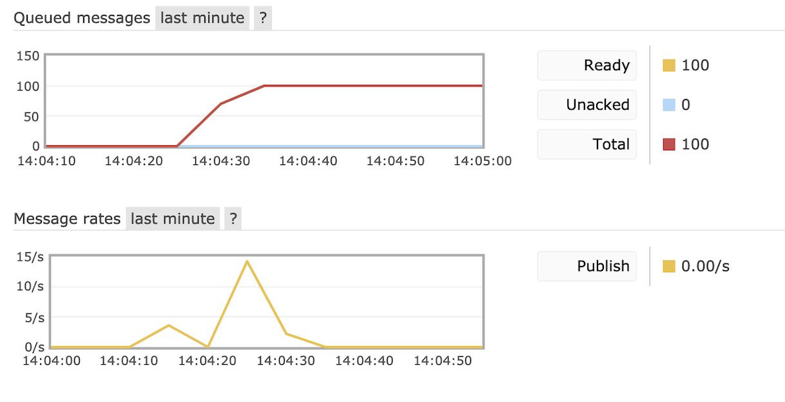
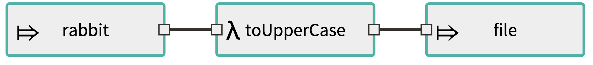

# Running a simple flow with SCDF using RabbitMQ

If you're here, then you're probably already familiar with *Spring Cloud Data Flow* (SCDF). In two words: [SCDF is a toolkit for building data integration and real-time data procssing pipelines](https://cloud.spring.io/spring-cloud-dataflow/).

In this example, we'll use RabbitMQ for two reasons:

* Deployed streams applications will communicate through it, and
* Our *source stream* will be a RabbitMQ queue

Running the system is easy, all what we need to do is running the given Docker compose file:

```bash
version: '3'

services:
  rabbitmq:
    image: "rabbitmq:3-management"
    ports:
      - "5672:5672"
      - "15672:15672"
  dataflow-server:
    image: springcloud/spring-cloud-dataflow-server-local:${DATAFLOW_VERSION}
    container_name: dataflow-server
    ports:
      - "9393:9393"
      - "9000-9010:9000-9010"
    environment:
      - spring.cloud.dataflow.applicationProperties.stream.spring.rabbitmq.host=rabbitmq
    depends_on:
      - rabbitmq
  app-import:
    image: springcloud/openjdk:latest
    depends_on:
      - dataflow-server
    command: >
      /bin/sh -c "
        while ! nc -z dataflow-server 9393;
        do
          sleep 1;
        done;
        wget -qO- 'http://dataflow-server:9393/apps' --post-data='uri=http://bit.ly/Celsius-SR3-stream-applications-rabbit-maven';
        echo 'Stream apps imported'
        wget -qO- 'http://dataflow-server:9393/apps' --post-data='uri=http://bit.ly/Clark-GA-task-applications-maven&force=true';
        echo 'Task apps imported'"
```

We define two containers, first one is the dataflow server itself, the second one is the RabbitMQ container (the "management version" gives us the RabbitMQ UI).

Note that we define in the server environment:

```
spring.cloud.dataflow.applicationProperties.stream.spring.rabbitmq.host=rabbitmq
```

to tell the server that "rabbitmq" is the host it should be using.

Let's run the containers:

```
DATAFLOW_VERSION=1.7.3.RELEASE docker-compose up
```

After all services are up and ready, we fill the queue using the provided Shell script:

```
bash send_to_rabbit.sh
```

In your browser, go to http://localhost:15672/ and you should see the 100 messages ready in the queue:



Now, let's head to the server itself that's available on http://localhost:9393/.

We'll define the following stream:

```bash
rabbit --queues=hello_queue --password=guest --host=rabbitmq --username=guest | toUpperCase: transform --expression='new String(payload).toUpperCase()' | file --name=rabbit_sink --directory=/tmp/
```

This defines a stream that looks as follows:



We read from the RabbitMQ queue that's called "hello_queue", then we make a *transformation* to convert each message, and write it bach to the file `/tmp/rabbit_sink`.

After deploying and running, we can connect to the server container and validate the output:

```
docker exec -it dataflow-server bash
$ cat /tmp/rabbit_sink 
```